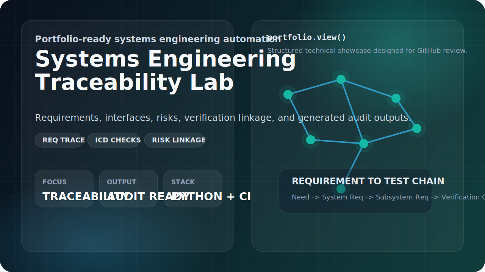
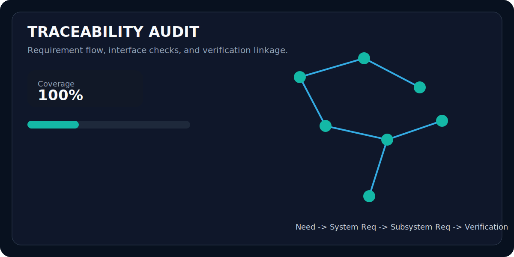

# Systems Engineering Traceability Lab

<p align="center">
  
</p>

<p align="center">
  
  
  
  
</p>

`Systems Engineering Traceability Lab` is a portfolio-ready repository for a systems engineering candidate who wants to show more than static documents. The repo combines a realistic system concept, structured engineering artifacts, automated validation, generated reports, and CI.

The flagship case study models an **Autonomous Wildfire Detection Drone System**. It demonstrates how stakeholder needs turn into system and subsystem requirements, how those requirements map to verification activities, and how interface and risk data stay connected across the repository.

## Demo Preview

<p align="center">
  
</p>

## Portfolio Project Ideas

If you want to grow this repository into a full portfolio, these are strong follow-on projects:

1. **Traceability Lab**: automate requirements linting, coverage, and audit-ready reports.
2. **Satellite Power Budget Simulator**: calculate energy margins across orbital scenarios.
3. **Interface Control Toolkit**: generate interface control documents and compatibility checks.
4. **Verification Readiness Dashboard**: track verification closure by subsystem and method.
5. **Trade Study Engine**: score architecture options against weighted mission criteria.
6. **FMEA and Reliability Workbench**: connect failure modes, mitigations, and residual risk.
7. **Autonomous Disaster Response Digital Thread**: tie the full portfolio together as a program-level umbrella repo with linked subrepositories.
8. **Program Risk Board**: aggregate program-level risks, review gates, and residual exposure.
9. **Ops Concept Simulator**: model mission-thread timing and subsystem participation.
10. **Autonomous Disaster Response Program Office**: layer the portfolio into direct hubs plus nested workstreams through a mega-scale umbrella repo.
11. **MBSE Model Registry**: add an architecture-view and model-package governance layer.
12. **Release Readiness Command Center**: track publishability, blockers, and release gates across repos.
13. **Federated MBSE Ecosystem**: place the entire portfolio under a top-most ecosystem umbrella with layered hubs.

This repository implements Idea 1 completely and now includes a generated portfolio roadmap for thirteen ideas. The flagship build plan lives in [docs/project_plan.md](docs/project_plan.md), while the multi-project roadmap source lives in `data/portfolio_projects.json` and exports to `reports/portfolio-roadmap.md`.

The largest umbrella layers are live here:

- `https://github.com/akifitu/autonomous-disaster-response-digital-thread`
- `https://github.com/akifitu/autonomous-disaster-response-program-office`
- `https://github.com/akifitu/federated-mbse-ecosystem`

## What This Repo Demonstrates

- Requirements decomposition from stakeholder level to subsystem level
- Bidirectional traceability between requirements and verification tests
- Interface consistency checks between subsystem producers and consumers
- Risk register scoring and mitigation linkage
- Reproducible Markdown and CSV report generation
- CI-ready repository structure with tests and automation

## Repository Map

```text
.
|-- data/                     # Engineering artifacts in structured JSON
|-- docs/                     # Concept, ideas, roadmap, and engineering notes
|-- reports/                  # Generated audit outputs committed for showcase
|-- src/se_traceability_lab/  # CLI, loaders, validators, and exporters
|-- tests/                    # Regression and end-to-end tests
|-- .github/workflows/        # CI pipeline
|-- Makefile                  # Common commands
`-- README.md
```

## Quick Start

```bash
make test
make audit
make roadmap
```

Or run the CLI directly:

```bash
PYTHONPATH=src python3 -m se_traceability_lab.cli audit --data-dir data --export-dir reports
PYTHONPATH=src python3 -m se_traceability_lab.cli roadmap --projects-file data/portfolio_projects.json --export-path reports/portfolio-roadmap.md
```

## Sample Output

After running the audit command the tool exports:

- `reports/audit-summary.md`
- `reports/traceability-matrix.csv`
- `reports/interface-register.csv`
- `reports/risk-register.csv`
- `reports/portfolio-roadmap.md`

The summary includes requirement coverage, high-risk count, interface inventory, and any validation errors or warnings.

## Documentation Index

- [docs/README.md](docs/README.md)
- [docs/portfolio_ideas.md](docs/portfolio_ideas.md)
- [docs/project_plan.md](docs/project_plan.md)
- [docs/system_concept.md](docs/system_concept.md)
- [docs/verification_strategy.md](docs/verification_strategy.md)
- `data/portfolio_projects.json`
- `reports/portfolio-roadmap.md`

## Why This Works As A Portfolio Piece

Hiring managers can inspect the system concept, the engineering data, the automation quality, and the software discipline in one place. It is not just a document dump: it shows systems thinking, structure, traceability, implementation, and an actionable portfolio roadmap for follow-on repos.
